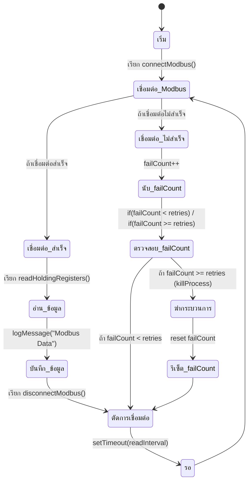

# Modbus Monitoring and Process Management

## Overview
This Node.js application continuously monitors a Modbus device via TCP and takes action if the connection fails multiple times. It is designed to:
- Connect to a Modbus device and read holding registers.
- Log data and errors to a file.
- Attempt automatic reconnection.
- Kill a specified process if the connection fails multiple times.

## Features
- **Modbus TCP Communication**: Reads data from a configured address.
- **Automatic Reconnection**: Attempts reconnection on failure.
- **Process Management**: Terminates a specified program if connection failures exceed a threshold.
- **Logging**: Stores logs with automatic file size management.

## Installation
### Prerequisites
- Node.js (>=14.x recommended)
- Modbus TCP device
- Windows OS (for process termination using `taskkill`)

### Steps
1. Clone the repository:
   ```sh
   git clone https://github.com/suthipongbb13/modbus-monitor.git
   ```
2. Go to the project folder:
   ```sh
   cd modbus-monitor
   ```
3. Install dependencies:
   ```sh
   npm install
   ```
4. Create a `.env` file and configure settings (see **Configuration** section).

## Configuration
Set the following environment variables in a `.env` file:

```env
MODBUS_HOST=127.0.0.1
MODBUS_PORT=502
MODBUS_UNIT_ID=1
MODBUS_ADDRESS=0
MODBUS_RETRIES=3
MODBUS_READ_INTERVAL=2000
PROGRAM_TO_KILL=notepad.exe
LOG_FILE=modbus.log
MAX_LOG_SIZE=5242880
MAX_BACKUP_FILES=5
```

- `MODBUS_HOST`: IP address of the Modbus device.
- `MODBUS_PORT`: Port number of the Modbus server.
- `MODBUS_UNIT_ID`: Unit ID of the Modbus device.
- `MODBUS_ADDRESS`: Address to read data from.
- `MODBUS_RETRIES`: Number of failed connection attempts before killing a process.
- `MODBUS_READ_INTERVAL`: Delay (in ms) between read attempts.
- `PROGRAM_TO_KILL`: Name of the program to terminate when failures exceed the retry limit.
- `LOG_FILE`: File path for logging.
- `MAX_LOG_SIZE`: Maximum log file size before rotation to backup files (in bytes).
- `MAX_BACKUP_FILES`: Maximum number of backup files.

## Usage
Run the application with:
```sh
node index.js
```

The application will:
1. Attempt to connect to the Modbus server.
2. Read and log Modbus data.
3. Retry connections on failure.
4. Kill the specified process if connection failures exceed `MODBUS_RETRIES`.

## State Diagram


## Logging
Logs are written to the file specified in `LOG_FILE`. If the file exceeds `MAX_LOG_SIZE`, it will be archived automatically.

## License
MIT License

## Author
Suthipong (SP)

